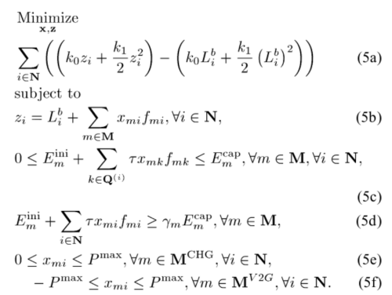
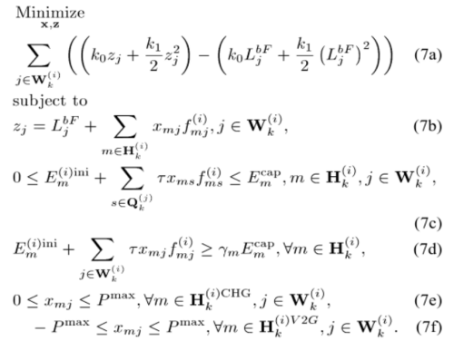

#  Optimal EV Scheduling — Implementation & Extensions

This repository contains a full MATLAB implementation of the optimization framework described in the paper:

[Optimal Scheduling for Charging and Discharging
of Electric Vehicles \(Yifeng He, Member, IEEE, Bala Venkatesh, Senior Member, IEEE, and Ling Guan, Fellow, IEEE\)](https://www.researchgate.net/publication/260648105_Optimal_Scheduling_for_Charging_and_Discharging_of_Electric_Vehicles)


The goal of this project is twofold:

1. **Reproduce the global and local (real-time MPC) scheduling strategies** presented in the paper.  
2. **Extend the model** with additional features such as renewable energy integration (e.g., PV power), weather-based constraints, and modern enhancements to EV scheduling.


## Problem Overview

Uncoordinated EV charging increases peak loads, grid stress, and energy costs.  
The cited IEEE paper proposes a convex optimization framework that schedules EV charging and discharging (V2G) in order to:

- Minimize total energy cost  
- Flatten the load curve  
- Ensure each EV meets its required State of Charge (SOC) by departure  
- Respect battery capacity limits and charging constraints  
- Provide a scalable real-time scheduling strategy  

## Mathematical Formulation (from the paper)

### **Global optimization**



### **Local optimization**



---

## Global vs. Local Scheduling (Paper Summary)

### **1 Global Optimization (Offline CVX Model)**

Solves a full-horizon convex problem using complete information for all EVs.
This produces a **benchmark optimal solution** but is computationally expensive for large fleets.

Output matrices:

* `v_x_Matrix`
* `v_energy_variation`

---

### **2 Local Optimization (Real-Time MPC with Grouping)**

A scalable method proposed in the paper:

* EVs are split into groups
* At each hour, only available EVs are optimized
* Only the first decision is applied (receding horizon)
* EV states are updated in real time

This method is practical for deployment in real charging stations.

Output matrices:

* `Rate_Matrix`
* `energy_variation`

---

## Extensions Implemented in This Repository

Beyond the original IEEE paper, this project introduces new data and constraint related to them.

### Maths

#### New objective function into [local optmization](#Local-optimization) 

$\min_{\mathbf{x},\,\mathbf{z}} \quad  \sum_{j \in \mathcal{W}_k^{(i)}} \left[ \left( k_0 z_j + \frac{k_1}{2} z_j^2 \right)-\left( k_0 L_j^{bF} + \frac{k_1}{2} (L_j^{bF})^2 \right)\right]\;+\;C_{P_k}\, A_k$


#### New constraints into [local optmization](#Local-optimization) 

$z_j = L_j^{bF} - P_j^{PV} + \sum_m x_{mj} f_{mj} , \qquad j \in \mathcal{W}_k^{(i)}$

$- z_j \le 0, \qquad j \in \mathcal{W}_k^{(i)}$

---

### Matlab - code

We obtain the solar data from `Solar.txt` and then insert into a variable(`Solar`):  


## Output Data Structures

Is possible to have an overview of the main data_structure (including code workflow) in the following file [Code scheme](src/Code_scheme.pdf)

| Variable             | Description                                  |
| -------------------- | -------------------------------------------- |
| `v_x_Matrix`         | Global optimal charging schedule             |
| `Rate_Matrix`        | Real-time MPC charging schedule              |
| `v_energy_variation` | Global SOC trajectories                      |
| `energy_variation`   | Local SOC trajectories                       |
| `EV_Matrix`          | Dynamic EV state (availability, SOC, status) |
| `E_Charged`          | Initial, charged, and final energy per EV    |
| `F`                  | EV availability matrix                       |

---

## Running the Code 

### 1. Install MATLAB and CVX

Follow CVX instructions at: [https://cvxr.com/cvx/](https://cvxr.com/cvx/)

### 2. Activate cvx

```matlab
cd $cxv_directory
cvx_setup
cd $code_directory
```
